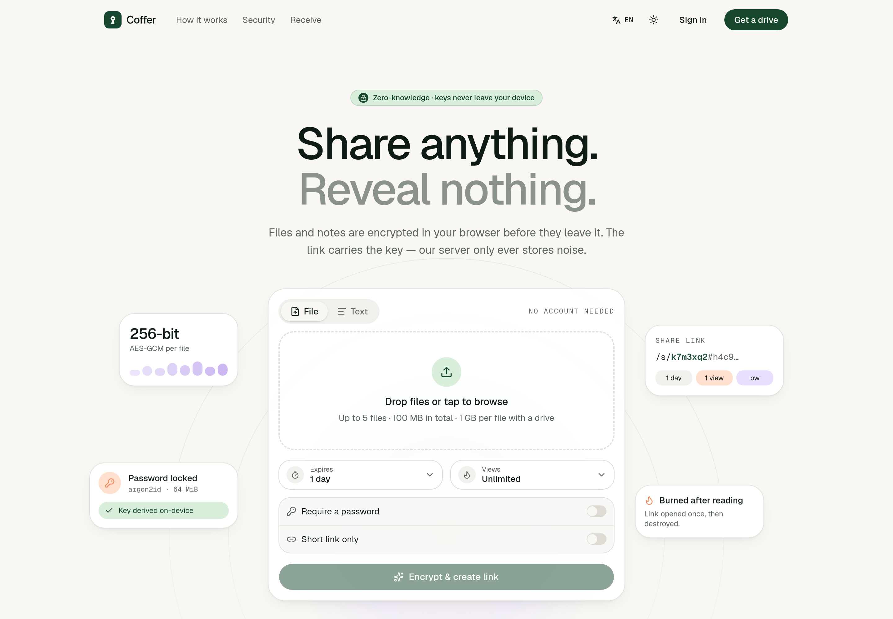

<div align="center">

# Coffer

**Share private files without making the other person sign up for anything.**

End-to-end encrypted file and note sharing, with an optional private drive.
The server stores only ciphertext: it cannot read a single file name.

[Self-hosting](docs/self-hosting.md) · [Security model](docs/security.md) · [Development](docs/development.md)

<br>



</div>

## What it does

- **Send files.** Drop files or paste a note and get a link. Whoever opens it needs no account and installs
  nothing: the file is decrypted in their browser.
- **Request files.** Make an upload link and send it to someone. They upload without an account; their browser
  encrypts each file so that only you can open it.
- **Keep a drive.** Sign up with an email and a password for encrypted folders, notes and a list of every link
  you have shared, each revocable at any time.

Links can expire, burn after a number of views, carry a password, and be revoked. Folder links follow the folder
as it changes, and can let the people you send them to add files of their own.

Available in English, Deutsch, Español, Nederlands, Русский and 中文.

## How it stays private

Files are encrypted in the browser with AES-256-GCM before upload, and the key travels in the part of the link
after the `#`, which browsers never send to a server. Passwords are stretched with Argon2id on the device.
Upload links use public-key encryption, so they can add files and do nothing else.

The details, and the limits, are in the [security model](docs/security.md).

## Run it

```sh
docker compose pull && docker compose up -d        # http://localhost:8080
```

One container, an embedded SQLite database, and nothing else to set up. For a public address with automatic
HTTPS, object storage, email, paid plans and the admin console, see [self-hosting](docs/self-hosting.md).

## Work on it

```sh
make install    # once
make server     # API on :8080
make web        # UI on :3000
make check      # format, lint, types and tests
```

Go server, React web app (TanStack Start, shadcn/ui). More in [development](docs/development.md).

## Contributing

Bug reports, fixes and translations are welcome. Start with [CONTRIBUTING.md](CONTRIBUTING.md); questions and ideas
go in [Discussions](https://github.com/krantro2938/coffer/discussions). To report a security problem, see
[SECURITY.md](SECURITY.md).

## License

[GNU Affero General Public License v3](LICENSE). You may run, study, change and share Coffer; if you offer a
changed version to others as a service, the AGPL asks you to offer them its source too.
